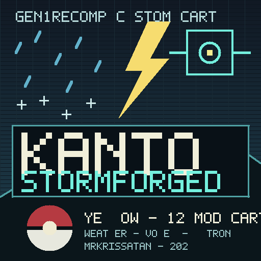

# KANTO: STORMFORGED ⚡🌧️

**KANTO: STORMFORGED** is a custom Gen1Recomp cartridge built on **Pokémon Yellow**, combining a rebuilt Kanto, dynamic weather, WX Pokémon, visible overworld encounters, voxel presentation, modern storage, Mystery Gift and autonomous robot rivals.

The goal is a version of Kanto that feels alive rather than merely remastered: storms roll across routes, wild Pokémon inhabit the overworld, buildings have been rebuilt, battles and exploration gain modern presentation, and Ultron's autonomous trainers pursue their own journeys alongside the player.

## Included mods

| Mod | Version | Project |
| --- | ---: | --- |
| Kanto Reforged | 1.5.3 | [1Jamie/Kanto-Reforged](https://github.com/1Jamie/Kanto-Reforged) |
| Weather FX | 4.31.0 | [MrKrisSatan/Weather-fx](https://github.com/MrKrisSatan/Weather-fx) |
| WX Pokémon / Weather Variants | 1.0.0 | [MrKrisSatan/WXpokes](https://github.com/MrKrisSatan/WXpokes) |
| Ultron | 2.47.1 | [MrKrisSatan/Ultron](https://github.com/MrKrisSatan/Ultron) |
| Wilds of Kanto | 2.1.9 | [YoDrehDenSwagAuf/overworld-spawn-mod](https://github.com/YoDrehDenSwagAuf/overworld-spawn-mod) |
| Mystery Gift | 0.1.0 | [thorkdev/gen1recomp-mystery-gift](https://github.com/thorkdev/gen1recomp-mystery-gift) |
| Dramaless Shape | 2.0.3 | [artyrambles/DRAMALESS_SHAPE](https://github.com/artyrambles/DRAMALESS_SHAPE) |
| Better Buildings | 1.16.0 | [HydroHomie31415/Better-Buildings](https://github.com/HydroHomie31415/Better-Buildings) |
| HGSS Visual Overhaul | 1.0.2 | [LucianoNeo/gen1recomp-mods](https://github.com/LucianoNeo/gen1recomp-mods) |
| Pokéball Colors | 0.1.33 | [mistermiracle3036/Pokeball-Colors](https://github.com/mistermiracle3036/Pokeball-Colors) |
| Modern PC UI | 0.4.1 | [piftee/gen1recomp-modern-pc-ui](https://github.com/piftee/gen1recomp-modern-pc-ui) |
| Running Shoes | 1.1.2 | [johnjohto/pokemon-mods](https://github.com/johnjohto/pokemon-mods/releases/tag/jj_running_shoes-v1.1.2) |

## Installation

1. Download the latest **KANTO: STORMFORGED** `.g1rcart` from this repository's Releases page.
2. Open Gen1Recomp and import the `.g1rcart`.
3. Allow Gen1Recomp to download and verify the pinned mods.
4. Install **Running Shoes 1.1.2** separately from its linked release.
5. Fully restart Gen1Recomp.
6. Start or load Pokémon Yellow.

The cart targets Gen1Recomp `>=0.1.86 <1.0.0` and allows normal 1× and 2× game speeds.

## Why Running Shoes is separate

Gen1Recomp's current cart resolver expects GitHub mod releases tagged as `v<version>` or `<version>`. Running Shoes 1.1.2 is published under `jj_running_shoes-v1.1.2`, so it cannot currently be represented as a valid native cart pin. STORMFORGED is therefore an **open** cart and Running Shoes is the one companion install.

## Better Buildings version

Better Buildings 1.19.0 is published under the non-semver release tag `night`. STORMFORGED therefore pins **1.16.0**, the newest conventional `v<version>` release that the stock cart resolver can reproducibly install. It already includes the major Kanto exterior overhaul and Dramaless Shape compatibility.

## Load order

The cart fixes this order to make the overlapping systems cooperate:

1. Kanto Reforged
2. Weather FX
3. WX Pokémon
4. Ultron
5. Wilds of Kanto
6. Mystery Gift
7. Dramaless Shape
8. Better Buildings
9. HGSS Visual Overhaul
10. Pokéball Colors
11. Modern PC UI

Running Shoes loads as the companion mod after the cart.

## Cartridge identity

- **Base:** Pokémon Yellow
- **Cart ID:** `kanto_stormforged`
- **Version:** 1.0.0
- **Shell:** storm blue `#203746`
- **Finish:** holo
- **Seal:** open

## Credits

STORMFORGED is a curated custom cart. The individual mods remain the work of their respective authors and are downloaded from their original public releases. The cart itself ships only its manifest, label art and release metadata.

Special thanks to every Gen1Recomp mod author whose work makes this gloriously over-engineered little Game Boy thundercloud possible. ⚡
